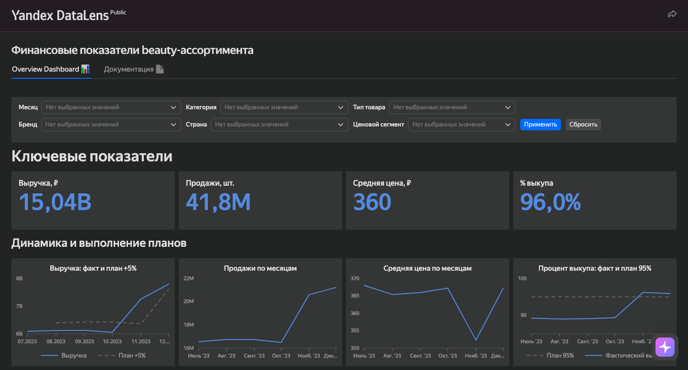

# Финансовые показатели beauty-ассортимента

Учебный проект по подготовке данных и созданию дашборда в Yandex DataLens.

[Открыть дашборд](https://datalens.yandex/zo5jmp0vnym8i)

## Задача

Подготовить дашборд для ежемесячной встречи руководителей и показать:

- выручку, продажи, среднюю цену и процент выкупа;
- изменение показателей по месяцам;
- выполнение планов по выручке и проценту выкупа;
- показатели по категориям, брендам и ценовым сегментам.

## Данные

Источник исходных данных: [Karpov.Courses](https://karpov.courses/).
Данные предоставлены в рамках учебного кейса и используются в образовательных целях. Подготовка данных, анализ и дашборд выполнены автором проекта.

## Что я сделала

- изучила исходные таблицы и проверила пропуски и дубликаты;
- переименовала столбцы;
- преобразовала данные по SKU из широкого формата в длинный;
- подготовила две таблицы для загрузки в DataLens;
- собрала дашборд с основными показателями, динамикой и фильтрами.

## Основные результаты

- в декабре выручка выросла на 7,39% к ноябрю и превысила план роста 5%;
- продажи выросли на 3%, а средняя цена — на 4,22%;
- процент выкупа остался выше целевого значения 95%;
- категория «Волосы» выросла на 3,85% и не достигла плана по выручке.

## Файлы проекта

- `notebooks/01_data_preparation.ipynb` — знакомство с данными и подготовка таблиц;
- `assets/dashboard.png` — превью дашборда;
- `data/` — описание исходных и подготовленных данных.

Исходные данные находятся в `data/raw/sales.xlsx`. Подготовленные CSV создаются
при запуске ноутбука и не хранятся в репозитории.

## Стек

Python, pandas, Excel, Yandex DataLens.
